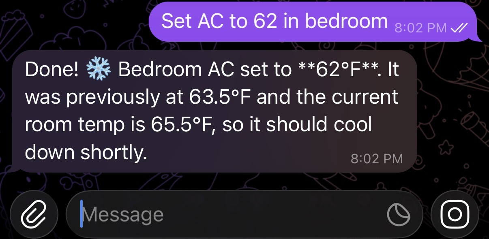
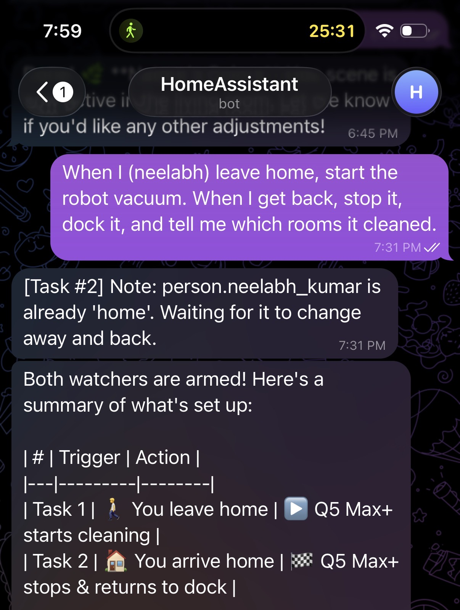
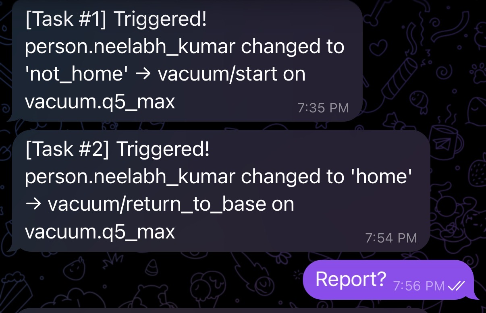
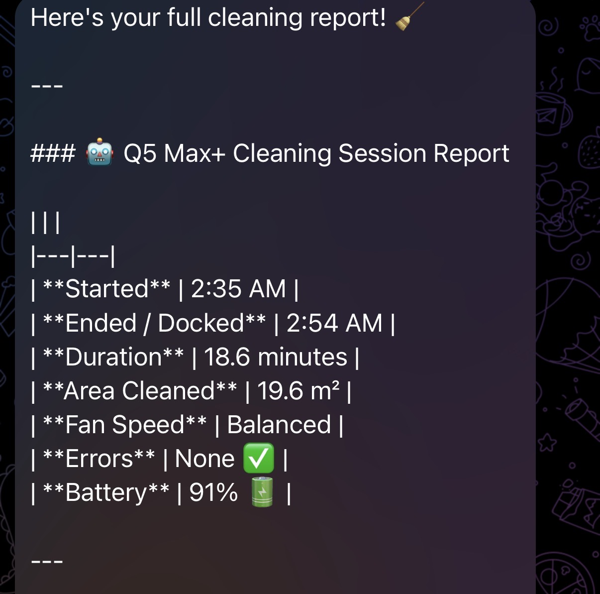

# ha-agent-telegram

AI-powered Home Assistant control via Telegram — with ephemeral automations that Home Assistant can't do natively.

## The Problem

Home Assistant automations are **persistent YAML files**. Every automation you create lives forever until you manually delete it. But most of what you actually want is one-shot:

- *"Turn on the porch light when I get home"* — just this once, not every day
- *"Turn off the TV in 20 minutes"* — a one-time timer, not a permanent automation
- *"Start the heater when the temperature drops below 60"* — just for tonight

The HA community has been [requesting ephemeral automations since 2020](https://community.home-assistant.io/t/wth-one-shot-actions-e-g-egg-timer/219825). No built-in solution exists.

**ha-agent-telegram** solves this. It's an AI agent that controls your entire Home Assistant setup via Telegram, with **ephemeral tasks that fire once and clean up automatically**. No YAML. No automation clutter.

## Features

- **Full HA control via natural language** — any service, any entity. Lights, climate, locks, media, covers, automations — if HA can do it, the agent can do it.
- **Ephemeral automations** — *"turn on lights when I get home"* creates a one-shot watcher that detects the state transition, fires, and disappears. Not a persistent HA automation.
- **Scheduled tasks** — *"turn off the TV in 20 minutes"* fires once after the delay and cleans up.
- **Task management** — ask *"what's running in the background?"* to see all active watchers and schedules. Cancel any task by ID.
- **Persistent memory** — the agent learns about you and your home over time. Knows your name, your devices, your preferences — so you don't repeat yourself.
- **Telegram group support** — add the bot to a family group so everyone can control the home.

## Demo

**Simple command** — natural language, instant action:



**Ephemeral automation** — *"start vacuum when I leave, dock it when I'm back"*:



Both watchers fire on real state transitions — no persistent HA automation created:



The agent pulls a full cleaning report when you ask:



## Quick Start

### 1. Get your tokens
- **Home Assistant**: [Long-lived access token](https://www.home-assistant.io/docs/authentication/) (Profile → Security → Create Token)
- **Telegram**: Message [@BotFather](https://t.me/BotFather) → `/newbot` → get your bot token
- **Anthropic**: Get an API key from [console.anthropic.com](https://console.anthropic.com/)

### 2. Configure

```bash
git clone https://github.com/nk3750/ha-agent-telegram.git
cd ha-agent-telegram
cp .env.example .env
# Edit .env with your tokens
```

### 3. Run

**With Docker (recommended):**
```bash
docker compose up -d
```

**Without Docker:**
```bash
python -m venv venv
source venv/bin/activate
pip install -r requirements.txt
python -m ha_agent.telegram_bot
```

### 4. Chat

Open your bot in Telegram and start talking:
- *"Turn on the living room lights"*
- *"Set the bedroom AC to 72"*
- *"What lights are on?"*
- *"Turn off the TV in 10 minutes"*
- *"Turn on the heater when the temperature drops below 60"*

Type `/chatid` in any chat to get the chat ID for access control.

## Architecture

```
Telegram                    Agent                         Home Assistant
───────                    ─────                         ──────────────
                    ┌──────────────────┐
 User message ───→ │    LangGraph     │
                    │   StateGraph     │
                    │                  │
                    │  ┌────────────┐  │    REST API
                    │  │  llm_call  │──┼──────────→  GET /api/states
                    │  └─────┬──────┘  │             POST /api/services
                    │        │         │             POST /api/template
                    │  should_continue? │
                    │   ╱          ╲    │
                    │  yes          no  │
                    │  ╱              ╲ │
                    │ ┌──────────┐  END │
                    │ │tool_node │     │
                    │ └────┬─────┘     │
                    │      └───→ back  │
                    │       to llm_call│
                    └──────────────────┘
                            │
 Agent response ←───────────┘
                            │
              ┌─────────────┴──────────────┐
              │   Background Threads       │
              │                            │
              │  schedule_service ──timer──→ fires action, notifies, dies
              │  watch_and_act ──poll────→ detects transition, fires, dies
              └────────────────────────────┘
```

**Stack:** Python · LangGraph · Claude (Anthropic SDK) · Home Assistant REST API · python-telegram-bot

## Tools

The agent has 11 tools:

| Tool | Category | What it does |
|---|---|---|
| `call_service` | Control | Call **any** HA service — lights, climate, locks, media, covers, automations, everything |
| `get_state` | Query | Get current state + attributes of any entity |
| `get_all_entities` | Query | Discover available entities, optionally filtered by domain |
| `get_services` | Query | Discover available services for any domain |
| `render_template` | Query | Run HA Jinja2 templates for complex queries |
| `schedule_service` | Background | Execute a service call after a delay |
| `watch_and_act` | Background | One-shot watcher — fires when an entity transitions to a target state |
| `list_active_tasks` | Background | Show all running background tasks |
| `cancel_task` | Background | Cancel a background task by ID |
| `save_memory` | Memory | Persist a fact about the user or home (core or learned) |
| `forget_memory` | Memory | Remove an outdated or incorrect memory |

## How Ephemeral Automations Work

When you say *"turn on the lights when I get home"*, the agent creates a **one-shot watcher**:

1. A background thread starts polling `person.you` every 5 seconds
2. It tracks the current state and waits for a **transition** to `home`
3. If you're already home, it waits for you to leave and come back (not a false trigger)
4. When the transition is detected → calls `light/turn_on` → notifies you via Telegram → thread dies

No HA automation is created. Nothing persists. The watcher lives in memory and cleans up after itself. If you restart the bot, pending watchers are gone — by design.

Scheduled tasks work similarly: a timer thread waits N seconds, fires the service call, notifies you, and exits.

You can check active tasks anytime (*"what's running?"*) and cancel any task (*"cancel task 2"*).

## How Memory Works

The agent learns about you over time so you don't have to repeat yourself.

**Two tiers:**
- **Core** (cap: 20) — things that rarely change: your name, timezone, household members, which person entity is you, preferred units
- **Learned** (cap: 50) — things it picks up: *"user's car is Tesla via device_tracker.tesla"*, *"bedroom light entity is light.bedroom_2"*, *"user prefers lights at 80%"*

When a tier hits its cap, the oldest memory is dropped to make room. Memories are stored in `data/memories.json` and persist across restarts.

The agent saves memories **proactively** — you don't have to tell it to remember. But you can also:
- *"Remember that my wife's name is Priya"*
- *"Forget that I prefer 72 degrees"*
- *"What do you remember about me?"*

## Configuration

| Variable | Required | Description |
|---|---|---|
| `HA_URL` | Yes | Your Home Assistant URL (e.g., `http://homeassistant.local:8123`) |
| `HA_TOKEN` | Yes | HA long-lived access token |
| `ANTHROPIC_API_KEY` | Yes | Anthropic API key for Claude |
| `TELEGRAM_BOT_TOKEN` | Yes | Telegram bot token from @BotFather |
| `ALLOWED_CHAT_IDS` | No | Comma-separated Telegram chat IDs. If empty, anyone can use the bot. |
| `MEMORY_FILE` | No | Path to memory file. Defaults to `data/memories.json`. |

## License

MIT
